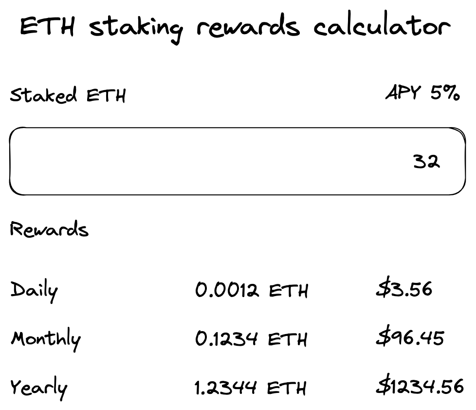

# React live coding exercise (30 min)

### Goal: build an ETH staking rewards calculator

Requirements:
- Users must be able to enter the number of ETH that they want to stake in an input
- Users can see their daily, monthly and yearly expected rewards in ETH and USD

UI should look like this, don't worry about styling, you can do it in the end if you have some time left.



To get ETH price, you can use this CoinGecko API endpoint:
```
https://api.coingecko.com/api/v3/simple/price?ids=ethereum&vs_currencies=usd
```

## Getting started

```
npm install
npm run dev
```